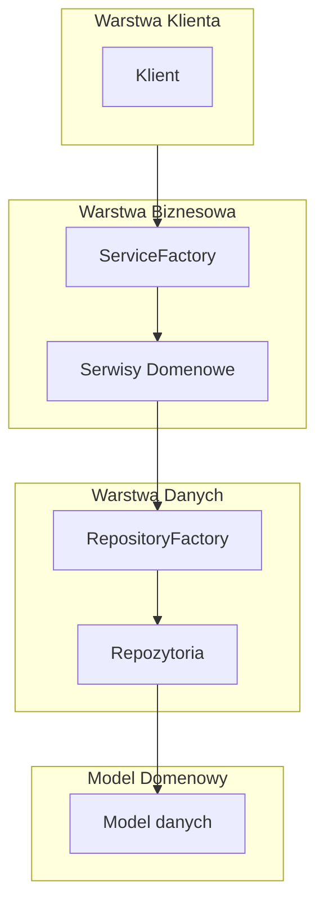

# UniversityDB - System Zarządzania Danymi Akademickimi

UniversityDB to zaawansowana aplikacja do zarządzania danymi akademickimi, zaprojektowana zgodnie z najlepszymi praktykami inżynierii oprogramowania. System został zbudowany w oparciu o:

- **Clean Architecture** - zapewniając czytelną separację warstw i niezależność od zewnętrznych frameworków
- **Zasady SOLID**:
  - **S**ingle Responsibility - każda klasa ma jedną, jasno określoną odpowiedzialność
  - **O**pen/Closed - komponenty są otwarte na rozszerzanie, zamknięte na modyfikacje
  - **L**iskov Substitution - interfejsy są projektowane z myślą o pełnej zastępowalności implementacji
  - **I**nterface Segregation - interfejsy są małe i specyficzne dla klienta
  - **D**ependency Inversion - wysokopoziomowe moduły nie zależą od niskopoziomowych implementacji

System umożliwia kompleksowe zarządzanie:
- Danymi studentów i ich ocenami
- Informacjami o pracownikach akademickich
- Kursami i kierunkami studiów
- Podstawowymi encjami wspierającymi (adresy, płeć)

## 🚀 Uruchomienie projektu

### Wymagania wstępne
- Python 3.12+
- pip (menedżer pakietów Python)
- Git

## ⚙️ Konfiguracja środowiska

1. Sklonuj repozytorium:
```bash
git clone https://github.com/aklopot/university_db.git
cd university_db
```

2. Utwórz wirtualne środowisko:
```bash
python -m venv .venv_universitydb
```

3. Aktywuj wirtualne środowisko:

Dla Linux/Git Bash:
```bash
source .venv_universitydb/Scripts/activate
```

Dla Windows (cmd):
```bash
.\.venv_universitydb\Scripts\activate
```

4. Zainstaluj zależności:
```bash
pip install -r requirements.txt
```

## ▶️ Uruchomienie aplikacji

Dostępne są trzy interfejsy użytkownika:

1. Aplikacja GUI (Kivy) [Linux/Git Bash]:
```bash
./run_universitydb_gui.sh
```
lub
```bash
python -m clients.gui_kivy.main
```

2. Interfejs wiersza poleceń (CLI) - *w trakcie implementacji*:
```bash
./run_universitydb_command.sh
```

3. API Web (FastAPI) - *w trakcie implementacji*:
```bash
./run_universitydb_api.sh
```

## 🏗️ Architektura systemu

---

### Przegląd
UniversityDB wykorzystuje architekturę warstwową, zapewniającą:
- Czystą separację warstw
- Łatwość rozbudowy
- Niezależność komponentów
- Wysoką testowalność

### Warstwy aplikacji



### Komponenty systemu

1. **Warstwa Klienta**
   - Interfejsy użytkownika (GUI, CLI, API)
   - Prezentacja danych

2. **Warstwa Biznesowa**
   - Logika biznesowa
   - Orkiestracja operacji

3. **Warstwa Danych**
   - Dostęp do danych
   - Implementacje dla JSON/SQLite/PostgreSQL

4. **Model Domenowy**
   - Encje biznesowe
   - Reguły domenowe

## 📝 TODO

- [ ] Implementacja interfejsu wiersza poleceń (CLI)
- [ ] Implementacja API Web z wykorzystaniem FastAPI
- [ ] Dodanie testów jednostkowych
- [ ] Rozbudowa dokumentacji API
- [ ] Implementacja uwierzytelniania i autoryzacji
- [ ] Dodanie wsparcia dla PostgreSQL

## 🔧 Konfiguracja

Konfiguracja źródła danych znajduje się w pliku `config/config.toml`. Dostępne opcje:
- JSON
- SQLite
- PostgreSQL (w przygotowaniu)

## 📚 Dokumentacja

Szczegółowa dokumentacja projektu znajduje się w katalogu `documentation/`:
- [Architektura systemu](documentation/architecture.md) - pełny opis architektury, wzorców projektowych i przepływu danych
- [Schema bazy danych](documentation/database_schema.png) - diagram przedstawiający strukturę bazy danych

## 🧪 Testy

### Konfiguracja środowiska testowego

1. Zainstaluj zależności deweloperskie:
```bash
pip install -r requirements-dev.txt
```

### Uruchamianie testów

1. Uruchom wszystkie testy:
```bash
pytest
```

2. Uruchom testy z wyświetlaniem szczegółów:
```bash
pytest -v
```

3. Uruchom testy z konkretnego modułu:
```bash
pytest tests/repositories/test_json_gender_repository.py
```

### Pokrycie kodu testami

1. Wygeneruj raport pokrycia:
```bash
coverage run -m pytest
coverage report
```

2. Wygeneruj szczegółowy raport HTML:
```bash
coverage html
```
Raport będzie dostępny w katalogu `htmlcov/index.html`

### Struktura testów

```
tests/
├── repositories/           # Testy repozytoriów
│   ├── test_json_gender_repository.py
│   └── test_json_student_repository.py
├── services/              # Testy serwisów
│   ├── test_student_grade_service.py
│   └── test_student_service.py
└── conftest.py           # Współdzielone fixtures
```

### Konwencje testowe
- Testy jednostkowe używają pytest
- Każdy test powinien zawierać sekcje: Arrange, Act, Assert
- Mockowanie zewnętrznych zależności przy użyciu pytest-mock
- Fixtures współdzielone w conftest.py

## 🤝 Współpraca

Zachęcamy do współpracy przy rozwoju projektu. Aby zgłosić błąd lub zaproponować nową funkcjonalność, utwórz Issue lub Pull Request.

## 📄 Licencja

Ten projekt jest oprogramowaniem open source, udostępnianym na licencji MIT. Oznacza to, że możesz:
- Używać kodu w projektach komercyjnych i niekomercyjnych
- Modyfikować kod źródłowy
- Dystrybuować oprogramowanie
- Używać go bez żadnych opłat

Szczegółowe warunki licencji znajdują się w pliku `LICENSE`. 