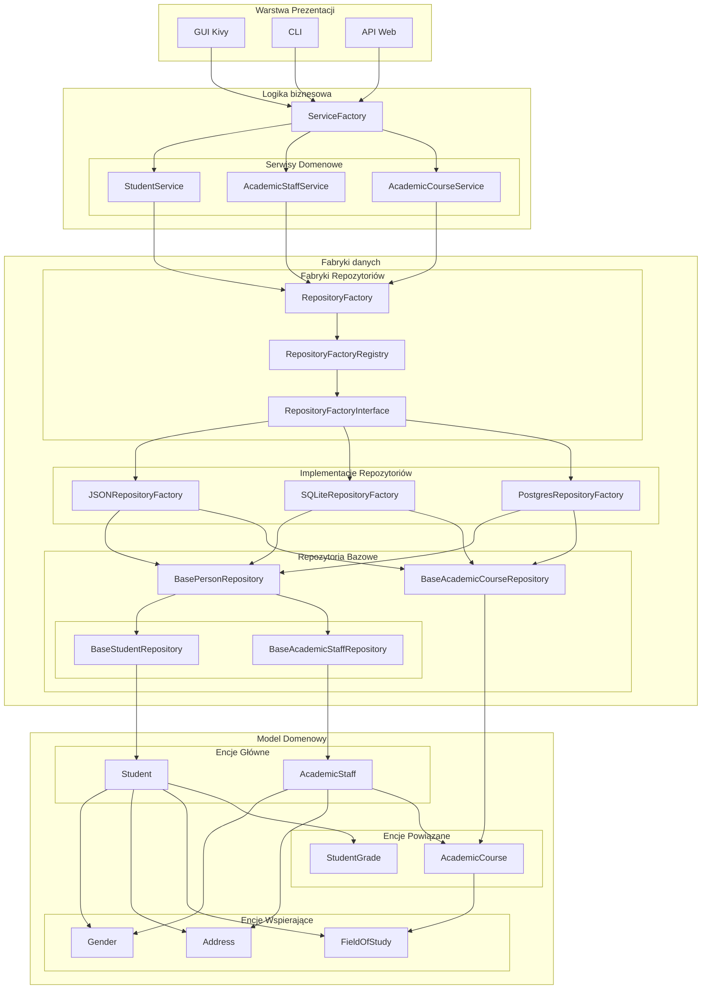

# Architektura Aplikacji UniversityDB

## Przegląd
UniversityDB to wielowarstwowa aplikacja do zarządzania danymi akademickimi, zaprojektowana zgodnie z zasadami Clean Architecture. System został podzielony na niezależne warstwy, co zapewnia separację odpowiedzialności i ułatwia utrzymanie oraz rozbudowę aplikacji. Przedstawiony diagram pokazuje kluczowe elementy architektury, pomijając niektóre szczegółowe komponenty dla zachowania przejrzystości.

## Diagram Architektury

## Opis Warstw

### 1. Warstwa Prezentacji
- **GUI Kivy**: Interfejs graficzny zbudowany przy użyciu frameworka Kivy, zawierający widoki dla studentów, pracowników i kursów
- **CLI**: Interfejs wiersza poleceń umożliwiający podstawowe operacje na danych
- **API Web**: RESTful API do integracji z systemami zewnętrznymi

### 2. Warstwa Logiki Biznesowej
- **ServiceFactory**: Fabryka odpowiedzialna za tworzenie i zarządzanie wszystkimi serwisami biznesowymi
- **Serwisy Domenowe**: 
  - StudentService: zarządzanie danymi studentów
  - AcademicStaffService: zarządzanie danymi pracowników
  - AcademicCourseService: zarządzanie kursami
  - Dodatkowe serwisy dla encji wspierających (Gender, Address, etc.)

### 3. Warstwa Dostępu do Danych
- **RepositoryFactory**: Centralna fabryka tworząca odpowiednie repozytoria
- **RepositoryFactoryRegistry**: Rejestr dostępnych implementacji repozytoriów
- **RepositoryFactoryInterface**: Interfejs definiujący kontrakt dla fabryk repozytoriów
- **Implementacje Repozytoriów**: 
  - JSONRepositoryFactory: implementacja zapisu do plików JSON
  - SQLiteRepositoryFactory: implementacja dla bazy SQLite
  - PostgresRepositoryFactory: implementacja dla PostgreSQL
- **Repozytoria Bazowe**: 
  - BasePersonRepository: bazowe repozytorium dla encji osobowych
  - BaseStudentRepository i BaseAcademicStaffRepository: specjalizowane repozytoria
  - BaseAcademicCourseRepository: repozytorium dla kursów

### 4. Model Domenowy
Reprezentuje encje biznesowe i ich relacje:
- **Encje Główne**:
  - Student: podstawowe dane studenta, powiązania z kursami i ocenami
  - AcademicStaff: dane pracowników akademickich
- **Encje Powiązane**:
  - AcademicCourse: informacje o kursach
  - StudentGrade: oceny studentów
- **Encje Wspierające**:
  - Gender: słownik płci
  - Address: dane adresowe
  - FieldOfStudy: kierunki studiów

## Zasady Architektury

1. **Separacja Odpowiedzialności**: Każda warstwa ma jasno określoną rolę i nie miesza się z odpowiedzialnościami innych warstw
2. **Dependency Inversion**: Warstwy wyższe nie zależą bezpośrednio od implementacji warstw niższych, komunikacja odbywa się przez interfejsy
3. **Single Responsibility**: Każdy komponent ma jedną, jasno określoną odpowiedzialność (np. serwisy dla konkretnych encji)
4. **Interface Segregation**: Interfejsy są podzielone na mniejsze, specyficzne dla konkretnych przypadków użycia
5. **Open/Closed Principle**: Architektura pozwala na łatwe dodawanie nowych implementacji bez modyfikacji istniejącego kodu

## Przepływ Danych

1. Warstwa prezentacji komunikuje się wyłącznie z ServiceFactory
2. ServiceFactory tworzy i zarządza odpowiednimi serwisami domenowymi
3. Serwisy domenowe korzystają z RepositoryFactory do uzyskania dostępu do danych
4. RepositoryFactory, poprzez system rejestracji i interfejsów, tworzy odpowiednie implementacje repozytoriów
5. Repozytoria bazowe definiują podstawowe operacje na danych
6. Model domenowy zapewnia spójną strukturę danych w całym systemie

## Uwaga
Diagram przedstawia kluczowe elementy architektury. W rzeczywistej implementacji istnieją dodatkowe komponenty i relacje, które zostały pominięte dla zachowania czytelności.
